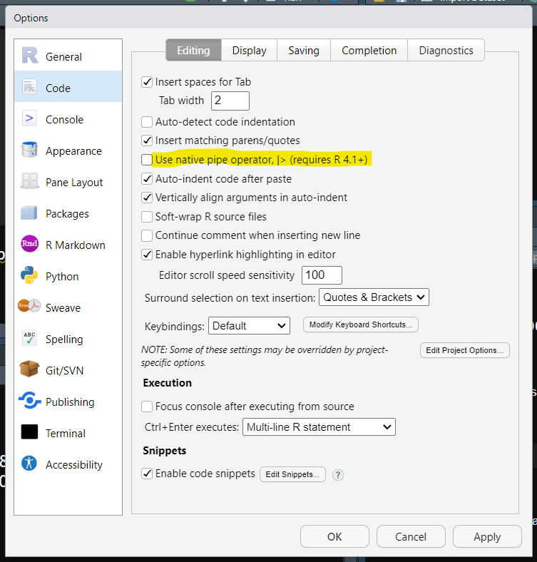

  

*Ce support, produit pour le live du [**27 juin 2023 sur Twitch**](https://www.twitch.tv/videos/1857087169), est mis à disposition selon les termes de la [Licence Creative Commons Attribution 4.0 International](http://creativecommons.org/licenses/by/4.0/).*  
  
```{r setup, include=FALSE}
knitr::opts_chunk$set(echo = TRUE, message = FALSE, warning = FALSE)
```
  
# Le pipe  
Lors des [Rencontres R 2023 à Avignon](https://rr2023.sciencesconf.org/), j'ai parlé du pipe pendant ma présentation.  
Suite aux discussions que j'ai eu dessus après, je préfère détailler à nouveau ici le `pipe %>%` du package `{margittr}` et le `pipe natif |> ` maintenant présent dans le package `{base}` (pour les versions de R > 4.1).  

```{r pipe}

# sans pipe
mean(sqrt(c(1:10)*3))

# avec pipe
c(1:10)*3 |> 
  sqrt() |> 
  mean()

# attention à l'utilisation des parenthèses
(c(1:10)*3) |> 
  sqrt() |> 
  mean()

```
  
Ici cela fonctionne sans chargé de package car j'utilise le pipe natif ` |> `.  
Cette option est modifiable dans **Tools > Global Options > Code > Editing**  
  
  
Si l'option `pipe natif` est décroché, le raccourci clavier `Ctrl + Maj + M` donne le pipe de `{magrittr}` mais ne permet pas de l'utiliser sans charger le package !  
**Attention**, lors du chargement de `{tidyverse}` le pipe de `{magrittr}` est automatiquement chargé.  

```{r pipe_magrittr, error=TRUE}
(c(1:10)*3) %>% 
  sqrt() %>% 
  mean()

library(magrittr)
(c(1:10)*3) %>% 
  sqrt() %>% 
  mean()

```
  
D'un point de vu utilsation, ` |> ` est plus rapide que `%>%` mais implique d'utiliser une version postérieure à `4.1`.  
  
# Les données  
Utilisation du jeu de données `penguins` du package `{palmerpenguins}` qui recense les caractéristiques des pingouins de l'archipel de Palmer.  
Plus d'informations sur ce jeu de données dans la page d'aide `help(penguins)`.  

# Visualisation rapide des données  
Avec la fonction très généraliste `plot()` chargée de base dans l’environnement.  
```{r visualiser_les_donnnes}

library(palmerpenguins)

penguins

View(penguins)

plot(penguins)

```

Pour avoir un apercu des données il est intéressant d'utiliser la fonction `summary()` présent dans le package `{base}`.  
```{r resume_des_donnees}

summary(penguins)


```
  
Il y a des valeurs manquantes, il faut donc les visualiser.  
[`{naniar}`](http://naniar.njtierney.com/) est un package très performant pour travailler sur les données manquantes.  
```{r visualiser_les_donnnees_manquantes}

naniar::gg_miss_upset(penguins)

```
  
Pour visualiser différement le tableau de données, il est possible d'utiliser la fonction `glimpse()` du `{tidyverse}`. Plus d'information sur le `{tidyverse}` dans le paragraphe ci-dessus [Le `{tidyverse}`](#le-tidyverse).  
```{r visualiser_le_tableau_de_donnees}

library(tidyverse)

glimpse(penguins)

```

**Attention** le chargement de certain package remplace des fonctions déjà chargées par celles chargée en dernière.  
*Par exemple, le chargement du package `{tidyverse}` ou `{dplyr}` remplace la fonction `filter()` du package `{stat}` par la sienne.* 
  
# Analyse univariée  
## Variable qualitative  
Il y a trois variables qualitatives ici :  `species`, `island` et `sex`.  
Toutes les trois sont finis -> donc on peut réaliser directement des tableaux de contingence.  

### Tableau de contingence  
```{r tableau_de_contingence}

# fonction `table()` du package `{base}`
table(penguins$species)
table(penguins$island)
table(penguins$sex)
# ne permet pas de voir les NA !

# fonction `count()` du package `{dplyr}`
count(penguins, sex)

```
**Attention** : Il vaut mieux utiliser `count()` de `{dplyr}` pour réaliser les tableaux de contingence car il permet de voir les valeurs manquantes (`NA`).  
  
  
### Représentation graphique  
Ressource conseillée pour la réalisation de graphiques : [From Data to Viz](https://www.data-to-viz.com/).  
```{r representation_graphique}
# diagramme en barres
penguins |> 
  ggplot() +
  aes(x = island) +
  geom_bar() +
  theme_bw()

# diagramme en barres colorées par l'espèces
penguins |> 
  ggplot() +
  aes(x = island, fill = species) +
  geom_bar() +
  theme_bw()

# diagramme circulaire
penguins |> 
  count(sex) |> 
  ggplot() +
  aes(x = "", y = n, fill = sex) +
  geom_bar(stat = "identity") +
  coord_polar("y") +
  theme_void()

# adapter la couleur
couleur <- c("female" = "yellow", "male" = "blue")

# changer la couleur d'un graphique
penguins |> 
  count(sex) |> 
  ggplot() +
  aes(x = "", y = n, fill = sex) +
  geom_bar(stat = "identity") +
  coord_polar("y") +
  scale_fill_manual(values = couleur) +
  theme_void()

```
  
## Variable quantitative  
Il y a 5 variables quantitatives, il est possible d'étudier leurs dispersion grâce aux histogrammes ou de calculer les mesures de cette dispersion.  
**Attention**, l'une des variables est l'année.  

### Histogramme  
**Attention** au nombre d'intervalles représenté.  
```{r histogramme}

penguins |>
  ggplot() +
  aes(x = bill_length_mm) +
  geom_histogram() +
  theme_classic()

# changement nombre d'intervalles (10)
penguins |>
  ggplot() +
  aes(x = bill_length_mm) +
  geom_histogram(bins = 10) +
  theme_classic()

# largeur de la barre
penguins |>
  ggplot() +
  aes(x = bill_length_mm) +
  geom_histogram(binwidth = 10) +
  theme_classic()


```
  
### Calcul des mesures de dispersion  
```{r mesures_dispersion}

summary(penguins)

mean(penguins$bill_depth_mm)
# NA car présence de valeur manquantes

mean(penguins$bill_length_mm, na.rm = TRUE)
max(penguins$bill_length_mm, na.rm = TRUE)

pingouins_sans_na <- penguins |> 
  drop_na()

median(pingouins_sans_na$bill_length_mm)

pingouins_sans_na |> 
  summarise(
    across(
      .cols = where(is.numeric),
      .fns = list(
        moyenne = ~ mean(.x),
        minimum = ~ min(.x),
        maximum = ~ max(.x)
      ),
      .names = "{col} {fn}"
    )
  ) |> 
  pivot_longer(everything()) |> 
  separate_wider_delim(
    name, 
    delim = " ", 
    names = c("variable", "mesure")
    ) |> 
  pivot_wider(names_from = mesure, values_from = value)


```

### Boîte à moustaches  
Graphique généralisant les données de dispersion.  
```{r boite_a_moustaches}

penguins |> 
  ggplot() +
  aes(y = bill_length_mm) +
  geom_boxplot() +
  theme_light()

# sur toutes les colonnes numériques
penguins |> 
  pivot_longer(
    cols = where(is.numeric)
  ) |> 
  ggplot() +
  aes(y = value) +
  facet_wrap(~ name, scales = "free_y") +
  geom_boxplot() +
  theme_light()
  
```
  
### Cas particulier des dates  
Il est clair que le traitement de l'année est un peu particulier, à ms chemin entre la variable qualitative et la variable quantitative.  
S'il y a peu de dates, comme c'est le cas ici autant la traiter comme une variable qualitative, c'est-à-dire réaliser un tableau de contingence pour voir le nombre d'individus capturé par an.  

```{r annee_variable_qualitative}
# tableau de contingence
penguins |> 
  count(year)

# réalisation d'un diagramme en barres
penguins |> 
  ggplot() +
  aes(x = year, fill = sex) +
  geom_bar() +
  scale_fill_manual(values = couleur) +
  theme_classic()

```

Si c'est une date complète, comment travailler dessus ?  
```{r traiter_les_dates}
# ajout de la date complète depuis le jeu de données `penguins_raw`
pingouins_modifie <- bind_cols(
  penguins,
  date = penguins_raw$`Date Egg`
) |> 
  mutate(
    mois = month(date, label = TRUE, abbr = FALSE),
    jour = day(date),
    jour_semaine = wday(date, label = TRUE, abbr = FALSE, week_start = 1)
  )

# repésentation en diagramme en barres
pingouins_modifie |> 
  ggplot() +
  aes(x = date, fill = jour_semaine) +
  geom_bar() +
  facet_wrap(~ year, scales = "free_x") +
  theme_bw()

```
   
   
# En savoir un peu plus sur moi  
Bonjour, 
  
Je suis Marie Vaugoyeau et je suis disponible pour des **missions en freelance** d’**accompagnement à la formation** à R et à l’analyse de données et/ou en **programmation** (reprise de scripts, bonnes pratiques de codage, développement de package).  
Ayant un **bagage recherche en écologie**, j’ai accompagné plusieurs chercheuses en biologie dans leurs analyses de données mais je suis ouverte à d’autres domaines.  
  
Vous pouvez retrouver mes offres [ici](https://marievaugoyeau.notion.site/MStats-Marie-Vaugoyeau-d69b566c83414152ac85eae012c970fb).  
  
**En plus de mes missions de consulting je diffuse mes savoirs en R et analyse de données sur plusieurs plateformes :**   

- J’ai écrit [un **livre** aux éditions ENI](https://www.editions-eni.fr/livre/langage-r-et-statistiques-initiation-a-l-analyse-de-donnees-9782409036934)  
- Tous les mois je fais [un **live sur Twitch**](https://www.twitch.tv/marievaugoyeau/videos) pour parler d’un package de R, d’une analyse  
- Je rédige une **newsletter** de manière irrégulière pour parler de mes **inspirations** et transmettre **des trucs et astuces sur R**. Pour s’y inscrire, [c’est par là](https://d1154691.sibforms.com/serve/MUIEAGj4fIubg6D4qHb7BoZSxNhzkV4p2L0I7GHpNopbqPeDS1J0SpOgaTDCavroygrDTCukB0La-8s1nsQw5wCANT5UP64en1GudsGbKhGVlwbvP_bJdAJ0ECF9BOZ1swRKEnKlnWzTHpLjknJvrCXiH_xw4F_go_2kVB0dWWrkJzRoE22BXImtgVOu29gBxx2hjFkINdeW7Cae?). J’ai aussi [un **blog**](https://mvaugoyeau.netlify.app/fr/), en PLS en ce moment, qu’il faut que je reprenne.  
  
Pour en savoir encore un peu plus sur moi, il y a [LinkedIn](https://www.linkedin.com/in/marie-vaugoyeau-72ab64153/) et pour retrouver [tous ces liens et plus encore, c'est ici](https://linktr.ee/mstats)  
  
**N’hésitez pas à me contacter sur [marie.vaugoyeau@gmail.com](mailto:marie.vaugoyeau@gmail.com) !**  
  
Bonne journée   

Marie  
  
  
  